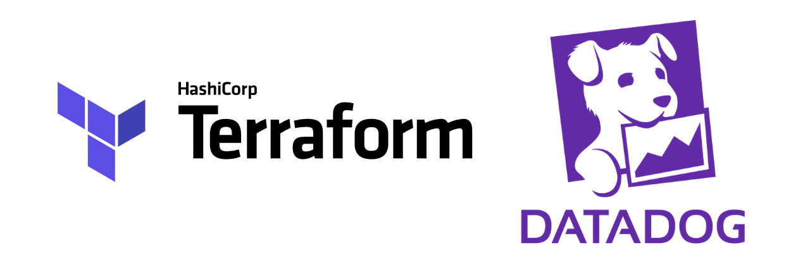

# Terraform Drift Conflict PoC


<div align="center">
  
</div>

This repository is a Proof of Concept (PoC) designed to demonstrate and handle **Terraform drift** and conflict resolution, specifically focusing on AWS RDS MySQL engine version upgrades.

## Project Overview

The project simulates a scenario where an infrastructure resource (AWS RDS) is modified outside of Terraform (using a Python script with Boto3), creating "drift." It then provides tools and a CI/CD pipeline to detect, report, and correct this drift.

## Infrastructure

- **Cloud Provider:** AWS
- **Resource:** `aws_db_instance` (MySQL 8.4.7) defined in `rds.tf`.
- **State Management:** S3 backend (configured in `main.tf`).

## Directory Structure

- `bash/`: Utility scripts for environment setup and drift correction.
- `python/`: Scripts to simulate drift by modifying resources directly via AWS API.
- `.github/workflows/`: GitHub Actions for CI/CD, drift detection, and Datadog monitoring.

## Getting Started

### 1. Prerequisites

- AWS CLI configured with appropriate permissions.
- Terraform installed.
- Python 3.x installed with `boto3`.

### 2. Setup State Bucket

Run the following script to create an S3 bucket for Terraform state:

```bash
./bash/create-bucket-state.sh
```

### 3. Initialize and Apply Terraform

```bash
terraform init -backend-config="bucket=tfstate-<YOUR_ACCOUNT_ID>" -backend-config="region=us-east-1"
terraform apply
```

## Simulating and Correcting Drift

### Simulate Drift (Manual Upgrade)

Use the Python script to upgrade the RDS instance engine version directly via the AWS API:

```bash
python3 python/upgrade.py
```

### Check Status

Monitor the upgrade progress:

```bash
python3 python/check_update.py
```

### Correct Drift

The `bash/correct-drift.sh` script demonstrates a manual correction strategy by removing the resource from the state and re-importing it:

```bash
./bash/correct-drift.sh
```

## CI/CD Pipeline

The GitHub Actions workflow (`terraform.yml`) automates the following:

1.  **Drift Detection:** Runs `terraform plan -detailed-exitcode`.
2.  **Manual Intervention:** Allows optional `terraform apply` via `workflow_dispatch`.
3.  **Observability:** Sends real-time metrics to **Datadog**:
    - `terraform.pipeline_success`
    - `terraform.drift_detected`
    - `terraform.apply_success`
    - `terraform.apply_error` / `terraform.plan_error`

### Required Secrets for GitHub Actions

- `AWS_ACCESS_KEY_ID`
- `AWS_SECRET_ACCESS_KEY`
- `AWS_REGION`
- `TF_STATE_BUCKET`
- `DATADOG_SITE` (Datadog API endpoint for metrics)
